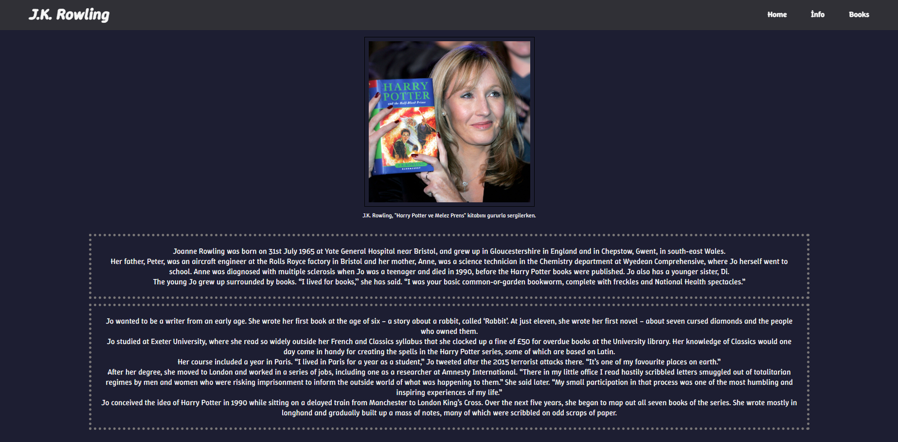

## Web Sitesine Aşağıdaki Linkten Erişebilirsiniz

📌 https://canbozv5.github.io/Tribute-Website📌

## Web Sitesinin Ufak Bir Önizlemesi

# J.K. Rowling Hayran Sayfası

Bu proje, ünlü yazar J.K. Rowling'e adanmış basit bir hayran sayfasıdır. Sayfa, yazar hakkında temel bilgileri, kitaplarını ve Harry Potter serisinden ilham verici alıntıları içermektedir.

## İçindekiler

- [Genel Bakış](#genel-bakış)
- [Özellikler](#özellikler)
- [Kullanılan Teknolojiler](#kullanılan-teknolojiler)
- [Bölümler](#bölümler)

## Genel Bakış

Bu HTML sayfası, J.K. Rowling'in hayatı ve eserleri hakkında bilgi veren tek sayfalık bir web sitesidir. Kullanıcı dostu bir navigasyon çubuğuna sahiptir.

## Özellikler

- **Duyarlı Tasarım**: (style.css dosyası incelenerek doğrulanmalı, ancak HTML yapısı genel bir web sayfası için tasarlanmıştır.)
- **Navigasyon**: Sayfa içinde kolay gezinme sağlayan sabit bir navigasyon çubuğu.
- **J.K. Rowling Hakkında Bilgi**: Yazarın doğum tarihi, ailesi, çocukluğu ve yazarlık kariyerinin başlangıcı hakkında bilgiler.
- **Harry Potter Kitapları**: Harry Potter serisi ve diğer ilgili kitapların listesi.
- **İlham Verici Alıntılar**: Harry Potter serisinden Albus Dumbledore'a ait seçme alıntılar.

## Kullanılan Teknolojiler

- HTML5
- CSS3 (Harici bir `style.css` dosyası bağlantılıdır.)
- Google Fonts (`Winky Rough` ve `Beau Rivage` fontları kullanılmıştır.)

## Bölümler

- **Ana Sayfa (`#home`)**: Harry Potter alıntılarını içeren ana giriş bölümü.
- **Bilgi (`#info`)**: J.K. Rowling'in hayatı ve kariyeri hakkında detaylı bilgi. Bu bölümde yazarın bir fotoğrafı ve altyazısı da bulunmaktadır.
- **Kitaplar (`#books`)**: J.K. Rowling tarafından yazılan kitapların bir listesi.
